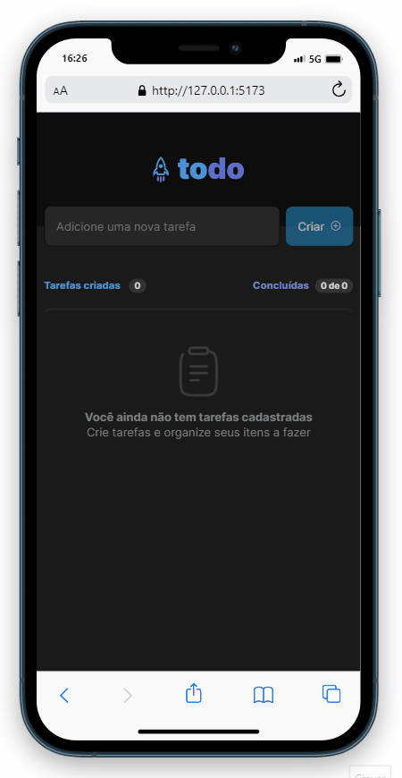
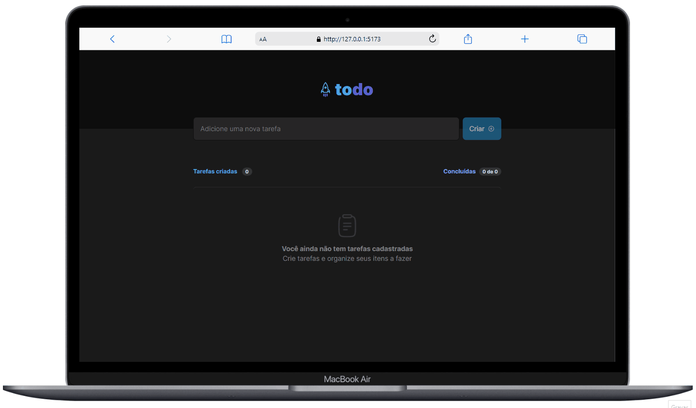

# :spiral_notepad: ToDo List

# :hamburger: food explorer - Frontend

ToDo List é uma aplicação que serve para guardar tarefas em uma lista, marcar as tarefas concluídas e excluir indesatáveis.

<h1 align="center">
    
</h1>

## :open_book: Sumário

- [Pré-Visualização](#clapper-pré-visualização)
- [Aviso](#loudspeaker-aviso)
- [Sobre](#memo-sobre)
- [Tecnologias](#floppy_disk-tecnologias)
- [Funcionalidades](#hammer-funcionalidades)
- [Autor](#nerd_face-autor)

</br>

## :clapper: Pré-Visualização

<h1 align="center">
  
</h1>

<h1 align="center">
  
</h1>

</br>

## :loudspeaker: Aviso

- O projeto **está finalizado**, mas poderá ter melhorias no futuro.

- Você pode testar a aplicação [clicando aqui!](https://todo-list-2023.netlify.app/)

- Você também pode clonar o repositório, e executar a aplicação localmente.

</br>

## :memo: Sobre

Este é o um dos projetos do programa [Ignite da Rocketseat](https://www.rocketseat.com.br/ignite), aonde foi proposto a construção de uma aplicação em Typescript para gerenciar uma lista de tarefas.

O design do projeto está disponível no [FIGMA](<https://www.figma.com/file/EgU4ubkS5OhlE8sAbROs3K/ToDo-List-(Copy)?node-id=101%3A98&t=3i3J57EXerQsZZXS-0>) e foi criado pela Millena Kupsinskü Martins(@millenakmartins).

</br>

## :floppy_disk: Tecnologias

- **ReactJS** - utilizado para construir as interfaces;
- **TypeScript** - usado para fazer toda a lógica da aplicação;
- **CSS** - utilizado para fazer a estilização;
- **Git** - responsável por realizar o versionamento do código.
- **Vite** - utilizado para criar um projeto React;
- **NPM** - usado para realizar a instalação das dependências;
- **sweetalert2** - utilizado para mostrar os alertas na tela;

</br>

## :hammer: Funcionalidades

- [] Adicionar uma tarefa;
- [] Concluir uma tarefa;
- [] Excluir um tarefa;
- [] Manter as tarefas(e seus status), no localStorage;

</br>

## :bulb: Utilização

- Comece clonando o projeto:

```bash
  $ git clone https://github.com/devgustavosantos/to-do-list.git
```

- Entre no diretório:

```bash
  $ cd to-do-list/
```

- Instale as dependências:

```bash
  $ npm install
```

- Inicie um servidor local:

```bash
  $ npm run dev
```

- Se tudo der certo, você receberá uma mensagem parecida com essa:

```bash
  VITE v3.0.9  ready in 1989 ms

  ➜  Local:   http://127.0.0.1:5173/
  ➜  Network: use --host to expose
```

- Agora abra seu navegador no endereço que foi informado no "`Local`" para testar a aplicação.

---

_Esses são os recursos disponíveis nessa Aplicação, se algum recurso não funcionar como o esperado, verifique essa documentação e tente novamente._

_Caso persista, por favor,entre em contato com [devgustavosantos@outlook.com](mailto:devgustavosantos@outlook.com)._

## :nerd_face: Autor

Feito com :heart: por Dev Gustavo Santos :grinning: Veja meu [LinkedIn.](https://www.linkedin.com/in/devgustavosantos/)
